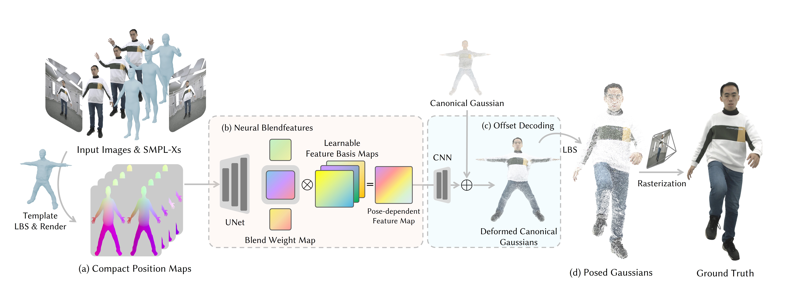

# NBAvatar: Real-time Gaussian Human Avatar using Neural Blendfeatures

We propose an avatar reconstruction method capable of capturing high-fidelity pose-dependent appearance while supporting real-time animation.

(a) Given multi-view input images and estimated SMPL-X poses, NBAvatar first reconstructs a template mesh and encodes it into compact position maps using Linear Blend Skinning (LBS).
(b) For each position map, a lightweight UNet transforms it to pose-dependent blend weight maps. These blend weight maps are subsequently combined with learnable feature basis maps to produce pose-dependent feature maps. 
(c) The feature maps are then decoded into Gaussian offsets via lightweight CNN decoders, which are further summed with optimizable canonical Gaussians. 
Finally, the deformed canonical Gaussians are (d) transformed to the target pose using LBS and rasterized to produce high-fidelity human images. 
This pipeline enables efficient and high-quality training and synthesis of drivable human avatars.

###  Acknowledgements
Our code is based on [Animatable Gaussians](https://github.com/lizhe00/AnimatableGaussians) and [EasyVolcap](https://github.com/zju3dv/EasyVolcap).
We thank the authors for their excellent work!