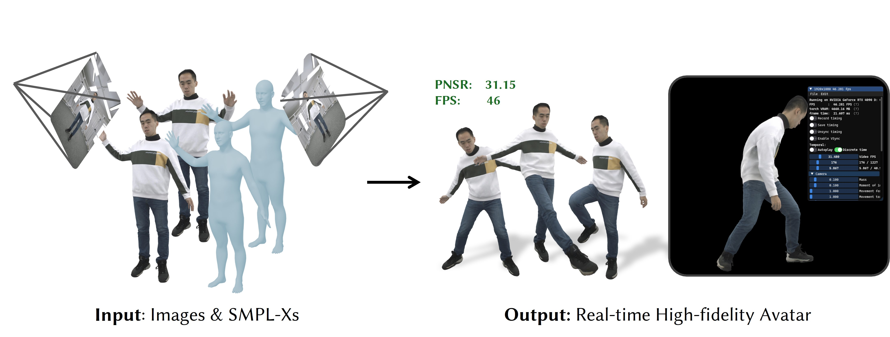

# NBAvatar: Real-time Gaussian Human Avatar using Neural Blendfeatures

We propose an avatar reconstruction method capable of capturing high-fidelity pose-dependent appearance while supporting real-time animation.

###  Acknowledgements
Our code is based on [Animatable Gaussians](https://github.com/lizhe00/AnimatableGaussians).
The GUI code is based on [EasyVolcap](https://github.com/zju3dv/EasyVolcap). 
We thank the authors for their excellent work!